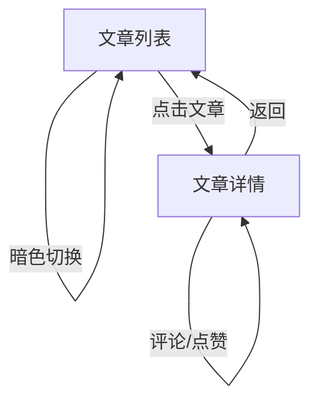

# Episode 33

响应式个人博客网站 —— 阅读、散步、独处与漫想，一个人的精神角落。

## 项目简介

从独立杂志排版中汲取灵感（Popeye / Brutus / Cereal），采用 HTML5 语义化标签、CSS3 三栏响应式布局和原生 JavaScript 构建的个人博客。设计追求克制——无 emoji，无渐变堆叠，用几何符号和线条语言构建视觉系统。

## 功能

- 文章列表按期号分组，支持分类筛选和关键词搜索
- 文章详情页 + 独立评论区（类似微博）
- 暗色模式切换，偏好保存至 localStorage
- 点赞 / 转发计数
- 评论表单验证，空内容拦截
- 响应式布局：PC 三栏 / 平板双栏 / 手机单栏
- 纸质纹理背景，杂志排版风格

## 技术栈

| 技术 | 用途 |
|------|------|
| HTML5 | 语义化页面结构 |
| CSS3 | Grid + Flexbox + 自定义属性 + 媒体查询 |
| JavaScript (ES6) | DOM 操作、事件处理、localStorage |
| Git LFS | 大文件版本管理 |

## 快速开始

### 方式一：直接打开

```bash
# 解压项目后双击 index.html
```

### 方式二：本地服务器

```bash
cd Episode33
python -m http.server 8080
# 浏览器访问 http://localhost:8080
```

### 方式三：VS Code Live Server

安装 Live Server 插件，右键 `index.html` → Open with Live Server。

## 项目结构

```
Episode33/
├── index.html          # 主页面（HTML5 语义化结构）
├── css/
│   └── style.css       # 样式表（响应式 + 暗色模式 + 纸质纹理）
├── js/
│   └── main.js         # 交互逻辑（筛选/搜索/评论/点赞）
├── docs/
│   ├── page-flow.md         # 页面流程图（Mermaid）
│   └── complete-flowchart.md # 完整流程图
└── Desktop 2026.06.13 - 22.27.18.04.mp4  # 功能演示视频
```

## 页面流程图



## 设计参考

- Popeye Magazine (Tokyo)
- Brutus Magazine (Tokyo)
- Cereal Magazine (UK)
- Kinfolk Magazine (US)
