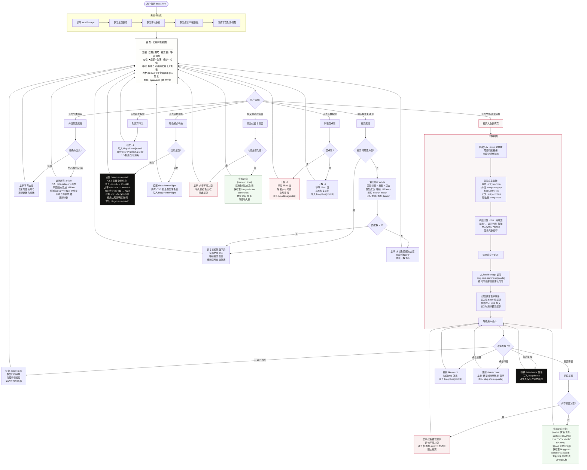

# Episode33 完整流程图

```mermaid
flowchart TD
    start(["用户打开 index.html"]) --> init

    subgraph init["系统初始化"]
        direction LR
        i1["读取 localStorage"] --> i2["恢复主题偏好"]
        i2 --> i3["恢复评论数据"]
        i3 --> i4["恢复点赞/转发计数"]
        i4 --> i5["渲染首页列表视图"]
    end

    init --> home

    home["首页 · 文章列表视图
    ─────────────────────
    顶栏: 日期 | 期号 | 搜索框 | 浅/暗切换
    左栏: ■全部 □生活 □摘抄 □心情
    中栏: 按期号分组的文章卡片列表
    右栏: 精选评论 | 留言表单 | 标签云
    页脚: Episode33 | 独立出版"]

    home --> choice{用户操作?}

    choice -->|"点击分类筛选"| filter
    choice -->|"输入搜索关键词"| search
    choice -->|"点击文章/阅读链接"| detail
    choice -->|"点击暗色切换"| theme
    choice -->|"提交侧边栏留言"| sidebar_comment
    choice -->|"点击点赞按钮"| like
    choice -->|"点击转发按钮"| share

    %% ===== 分类筛选 =====
    filter["分类筛选流程"] --> fc{选择的分类?}

    fc -->|全部| fa["显示所有文章
    恢复隐藏的期号
    更新计数为总数"]

    fc -->|生活/摘抄/心情| fs["遍历所有 article
    匹配 data-category 属性
    不匹配的添加 .hidden
    检测每期是否还有可见文章
    空期号整体隐藏
    更新计数"]

    fa --> home
    fs --> home

    %% ===== 搜索 =====
    search["搜索流程"] --> sq{搜索词是否为空?}

    sq -->|是| sr["恢复当前筛选下的
    全部文章显示
    移除搜索高亮
    重新应用分类筛选"]

    sq -->|否| ss["遍历所有 article
    匹配标题 + 摘要 + 正文
    匹配成功: 移除 .hidden + 添加 .search-match
    匹配失败: 添加 .hidden"]

    ss --> sc{匹配数 > 0?}

    sc -->|是| sr
    sc -->|否| sn["显示 '未找到匹配的文章'
    隐藏所有期号
    更新计数为 0"]

    sn --> home
    sr --> home

    %% ===== 文章详情页 =====
    detail["打开文章详情页"] --> dp

    subgraph dp["详情视图"]
        direction TB
        d1["隐藏所有 .issue 期号块
        隐藏归档链接
        隐藏空结果提示"] --> d2["提取文章数据:
        · 编号 .entry-number
        · 分类 .entry-category
        · 标题 .entry-title
        · 正文 .entry-content
        · 元数据 .entry-meta"] --> d3["构建详情 HTML 并填充
        显示 '← 返回列表' 按钮
        显示完整正文内容
        显示元数据行"]

        d3 --> d4["渲染独立评论区:"]
        d4 --> d5["从 localStorage 读取
        blog-post-comments[postId]
        按时间倒序渲染评论气泡"]

        d5 --> d6["绑定评论表单事件:
        输入框 Enter 键提交
        发布按钮 click 提交
        输入时清除错误提示"]

        d6 --> d7["等待用户操作..."]
    end

    d7 --> dc{详情页操作?}

    dc -->|"← 返回列表"| db["恢复 .issue 显示
    恢复归档链接
    隐藏详情视图
    滚动到列表顶部"] --> home

    dc -->|"提交评论"| dsub

    dsub["评论提交"] --> dv{内容是否为空?}

    dv -->|是| derr["显示红色错误提示
    '评论不能为空'
    输入框添加 .error 红色边框
    阻止提交"]

    dv -->|否| dok["生成评论对象:
    {name: '匿名读者',
     content: 输入内容,
     time: YYYY.MM.DD HH:MM}
    插入评论数组头部
    保存至 blog-post-comments[postId]
    重新渲染评论列表
    清空输入框"]

    derr --> d7
    dok --> d7

    dc -->|"点击点赞"| dlike["更新 like-count
    动画 pop 效果
    写入 blog-likes[postId]"] --> d7

    dc -->|"点击转发"| dshare["更新 share-count
    显示 '已复制分享链接' 提示
    写入 blog-shares[postId]"] --> d7

    dc -->|"暗色切换"| dtheme["切换 data-theme 属性
    写入 blog-theme
    详情页保持在暗色模式"] --> d7

    %% ===== 暗色模式 =====
    theme["暗色模式切换"] --> tc{当前主题?}

    tc -->|浅色| td["设置 data-theme='dark'
    CSS 变量全部切换:
    背景 #fefefb → #111110
    文字 #1a1a1a → #e8e4dc
    分割线 #e8e4dc → #222
    红色 #c41e3a 保持不变
    纸质纹理透明度微调
    写入 blog-theme='dark'"]

    tc -->|暗色| tl["设置 data-theme='light'
    所有 CSS 变量恢复浅色值
    写入 blog-theme='light'"]

    td --> home
    tl --> home

    %% ===== 侧边栏留言 =====
    sidebar_comment["侧边栏留言提交"] --> sv{内容是否为空?}

    sv -->|是| serr["显示 '内容不能为空'
    输入框红色边框
    阻止提交"]

    sv -->|否| sok["生成评论:
    {content, time}
    渲染到侧边栏列表
    保存至 blog-sidebar-comments
    最多保留 20 条
    清空输入框"]

    serr --> home
    sok --> home

    %% ===== 点赞 =====
    like["列表页点赞"] --> lv{已点赞?}

    lv -->|否| ladd["计数 +1
    添加 .liked 类
    触发 pop 动画
    心形变红
    写入 blog-likes[postId]"]

    lv -->|是| lremove["计数 -1
    移除 .liked 类
    心形恢复灰色
    写入 blog-likes[postId]"]

    ladd --> home
    lremove --> home

    %% ===== 转发 =====
    share["列表页转发"] --> shareadd["计数 +1
    写入 blog-shares[postId]
    弹出提示 '已复制分享链接'
    1.5 秒后自动消失"] --> home

    %% ===== 主题颜色 =====
    style home fill:#fefefb,stroke:#1a1a1a,color:#1a1a1a
    style detail fill:#faf6f6,stroke:#c41e3a,color:#1a1a1a
    style dp fill:#faf6f6,stroke:#c41e3a,color:#1a1a1a
    style td fill:#111110,stroke:#e8e4dc,color:#e8e4dc
    style dtheme fill:#111110,stroke:#e8e4dc,color:#e8e4dc
    style dok fill:#f0faf0,stroke:#6b8e6b,color:#333
    style sok fill:#f0faf0,stroke:#6b8e6b,color:#333
    style derr fill:#faf0f0,stroke:#c41e3a,color:#333
    style serr fill:#faf0f0,stroke:#c41e3a,color:#333
    style ladd fill:#fef0f0,stroke:#c41e3a,color:#333
```

## 图例说明

| 颜色 | 含义 |
|------|------|
| 白色框 | 首页列表视图 |
| 红色边框框 | 文章详情页视图 |
| 黑色填充框 | 暗色模式 |
| 绿色填充框 | 操作成功 |
| 红色填充框 | 操作失败（验证拦截） |
| 粉色填充框 | 点赞/转发 |
