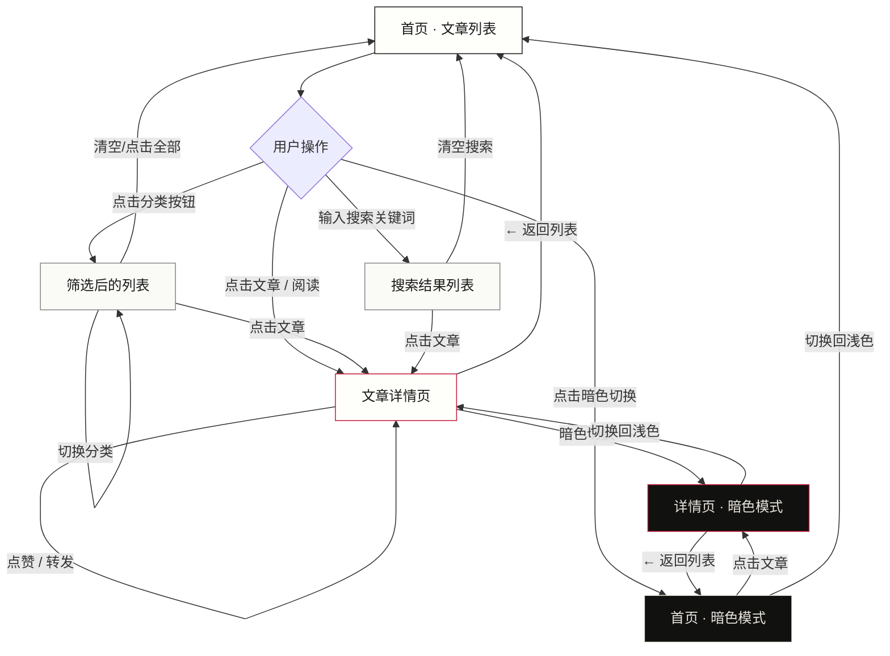
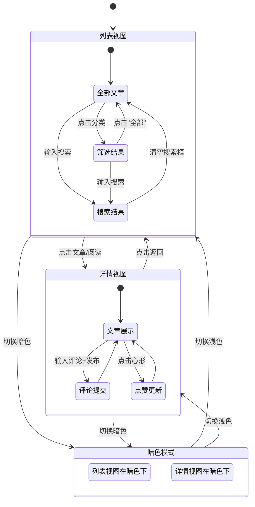
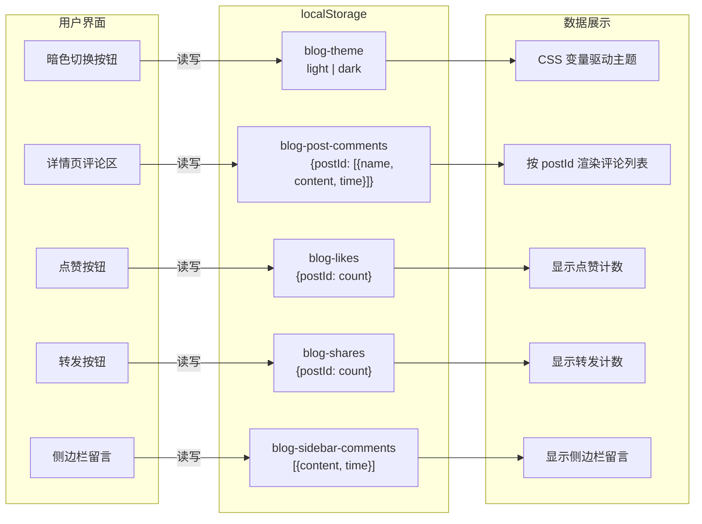

# Episode33 页面流程图

## 1. 页面导航流程图



## 2. 页面结构图（PC 端三栏布局）

```mermaid
block-beta
    columns 3
    
    block:top:3
        columns 1
        t1["顶栏 strip · 日期 | 期号 | 搜索 | 浅/暗"]
    end
    
    block:header:3
        columns 1
        t2["刊头 masthead · Episode 33"]
        t3["导航 nav · 文章 | 关于 | 归档"]
    end
    
    block:body:3
        block:left
            l1["◆ 分类"]
            l2["■ 全部"]
            l3["□ 生活"]
            l4["□ 摘抄"]
            l5["□ 心情"]
            l6["───"]
            l7["共 N 篇文章"]
        end
        
        block:center
            c1["第十三期 ─── 2025年6月"]
            c2["01 ◆专题 代码 · 文章标题 · 摘要 · ♡42 ↗12"]
            c3["02 设计 · 文章标题 · 摘要"]
            c4["03 随笔 · 文章标题 · 摘要"]
            c5["第十二期 ─── 2025年5月"]
            c6["04 代码 · 文章标题 · 摘要"]
            c7["05 随笔 · 文章标题 · 摘要"]
            c8["更早的期号 →"]
        end
        
        block:right
            r1["◆ 互动"]
            r2["精选评论引用"]
            r3["评论表单"]
            r4["───"]
            r5["标签云"]
        end
    end
    
    block:footer:3
        columns 1
        f1["页脚 footer · Episode33 | 独立出版 | 2025"]
    end

    left style fill:#fafaf6
    center style fill:#fefefb
    right style fill:#fafaf6
```

## 3. 文章详情页结构

```mermaid
block-beta
    columns 3
    
    block:top:3
        columns 1
        t1["顶栏 · 日期 | 期号 | 搜索 | 浅/暗"]
    end
    
    block:main:3
        block:ls
            l1["◆ 分类"]
            l2["■ 全部 □ 生活"]
        end
        
        block:detail
            d1["← 返回列表"]
            d2["01 ◆专题 分类"]
            d3["文章完整标题"]
            d4["多段落正文内容..."]
            d5["─── 点赞 | 转发 | 评论数"]
            d6["◆ 评论 N"]
            d7["读者A: 评论内容"]
            d8["读者B: 评论内容"]
            d9["[___________] 发布"]
        end
        
        block:rs
            r1["◆ 互动"]
            r2["标签云"]
        end
    end
    
    block:footer:3
        columns 1
        f1["页脚 · Episode33 · 独立出版"]
    end

    style d2 fill:#fefefb,stroke:#c41e3a
```



## 4. 响应式布局变化

```mermaid
flowchart LR
    subgraph PC["PC > 1024px"]
        direction TB
        pc1["三栏 Grid"]
        pc2["140px | 1fr | 170px"]
        pc3["左: 垂直分类筛选"]
        pc4["中: 文章列表 + 详情"]
        pc5["右: 互动区 + 标签"]
    end
    
    subgraph Tablet["平板 768-1024px"]
        direction TB
        t1["双栏 Grid"]
        t2["110px | 1fr"]
        t3["底部: 互动区两列横排"]
    end
    
    subgraph Phone["手机 < 768px"]
        direction TB
        ph1["单栏"]
        ph2["分类: 横向滚动条"]
        ph3["文章: 全宽单列"]
        ph4["互动: 底部纵向"]
    end
    
    PC --> Tablet --> Phone
```



## 5. 交互状态流转



## 6. 数据流图


